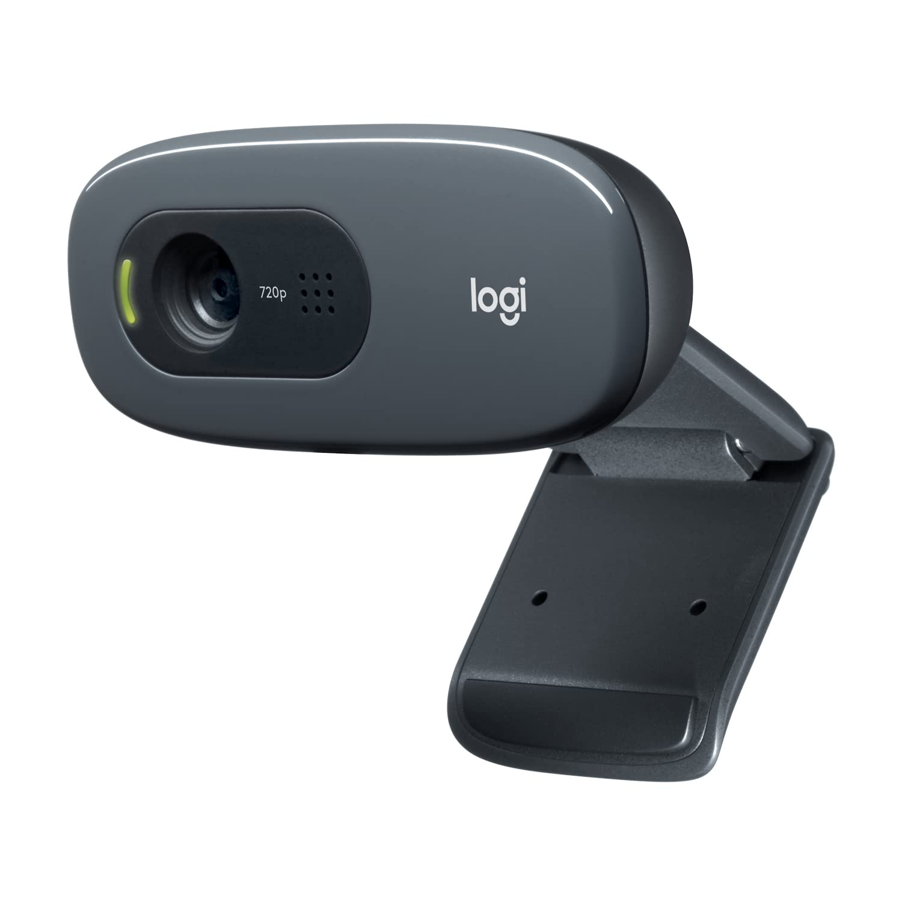

# Smart Facial Recognition Access Control System

## 📌 Project Overview

This project proposes a **facial recognition control system** using **edge and fog computing** concepts. The system aims to automatically identify whether a person is authorized to access a space (e.g., a room or cabinet) by matching their face with entries in a whitelist. It is especially useful for protecting children or the elderly from dangerous items and maintaining personal privacy at home.

## 🎯 Motivation

1. **Safety:** Prevent children or elderly people from accessing hazardous items without relying on inconvenient physical methods (e.g., hiding or placing items high).
2. **Privacy:** Prevent unauthorized access to private spaces (like bedrooms) by detecting and denying entry to uninvited guests.

## 🔧 Devices Used

- **Coral Dev Board:** Handles local computation and model inference.

- **Camera:** Captures facial features for analysis.

## 🧠 Approach

The facial recognition pipeline consists of the following steps:

1. **Face Detection:**  
   - Pre-trained model: `Inception-ResNet-V1`
   - Detect and locate faces in the input image.

2. **Face Preprocessing:**  
   - Crop and resize detected face regions to standardize input.

3. **Feature Extraction:**  
   - A Convolutional Neural Network (CNN) converts each face into a feature vector.
   - Model: `InceptionResnetV1(pretrained='vggface2', num_classes=2)`

4. **Whitelist Comparison:**  
   - The feature vector is compared with stored whitelist embeddings.
   - If the similarity score exceeds a threshold, access is granted.

## 📂 Dataset Collection

- Data gathered via an external camera and OBS software.
- Frames were extracted every 15 frames using OpenCV.
- Faces were validated using MTCNN.
- Final dataset:  
  - Person A: 300 images  
  - Person B: 90 images  
  - Total: 390 valid facial images

## Current Status
> [!WARNING]
> Due to issues with model conversion, we are currently unable to run the model on the Coral Dev Board. Our team is actively working on resolving this issue.

## ➕ Future Work: Dynamic Whitelist Updates

- Press a button to trigger video recording.
- Extract frames and convert each to embeddings.
- Average embeddings to form a new user’s feature vector.
- Add this vector to the whitelist.

## 🏁 Goal

- Create a door/cabinet lock system that only opens for authorized individuals.
- Allow for future expansion by scanning and adding new authorized faces (e.g., doctors, family members).

## 📚 Reference

This project references and fine-tunes models from the excellent [facenet-pytorch](https://github.com/timesler/facenet-pytorch/tree/master/models) repository by [@timesler](https://github.com/timesler).  
We sincerely thank the author for sharing this work under the MIT License.

## 👥 Team Members

Group 4  
- 薛凱陽 (411770257)  
- 陳怡安 (411770828)  
- 翁旻聖 (411770505)
